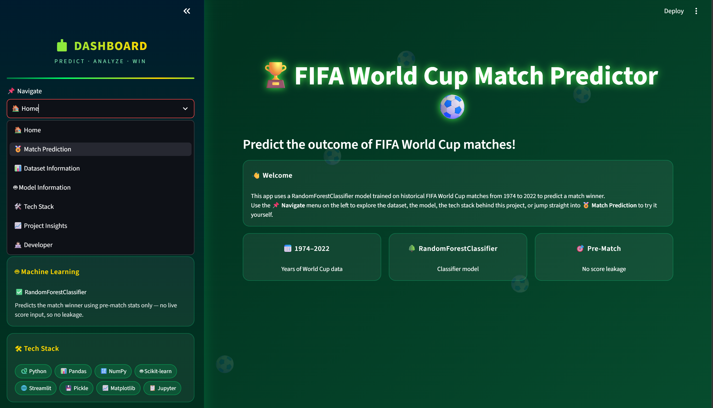
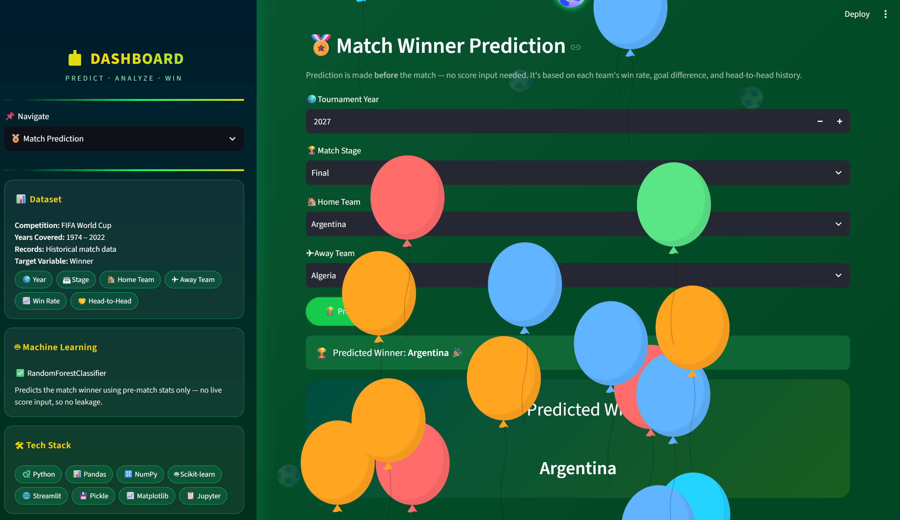

# 🏆 FIFA World Cup Match Predictor

An interactive Streamlit web app that predicts the winner of FIFA World Cup matches using a Machine Learning model trained on historical data from 1974 to 2022.
---

## 📌 Features

- **🏅 Match Prediction**: Predict winner based on Year, Stage, Home Team, Away Team
- **📊 Dynamic Stats**: Team winrate, goal difference and Head-to-Head stats update after each prediction
- **🤖 ML Powered**: Uses `RandomForestClassifier` trained on historical FIFA data
- **📈 Beautiful Dashboard**: Animated background, floating footballs, and responsive UI
- **📋 No Score Leakage**: Only uses pre-match stats. No final score used as input

---

## 🛠 Tech Stack

- **Language**: Python 3.10+
- **Frontend**: Streamlit
- **ML**: Scikit-learn, Pandas, NumPy
- **Model Saving**: Pickle
- **Visualization**: Matplotlib

---

## 📁 Project Structure
WORLD_CUP_PREDICTOR/
│
├── app.py                    # Main Streamlit App - Run this file
├── prediction.py             # ML logic, feature engineering, prediction functions
├── dashboard.png             # Screenshot of Dashboard
├── prediction.png            # Screenshot of Prediction Page
│
├── world_cup_predictor.pkl   # Trained RandomForest model
├── winner_encoder.pkl        # LabelEncoder for teams
├── feature_columns.pkl       # List of feature columns used in training
│
├── requirements.txt          # Dependencies
└── README.md                 # Project documentation

---

## **📈 Dataset Info**
- Source: Historical FIFA World Cup matches 1974-2022
- Features: Year, Stage, Win Rate, Goal Diff Avg, Head-to-Head, Matches Played
- Target: Winner

##  **🎮 How to UseOpen** 
 - 1. 🏅 Match Prediction from the sidebar
 - 2. Select:Tournament Year: e.g. 2026
        - Match Stage: e.g. Final, Semi-finals, Group
        - Home Team and Away Team
 - 3. Click 🏆 Predict Winner
 - 4. The app will show winner + win probability. Stats update after each prediction.

## 🚀 Installation & Running

**1.Create virtual environment**
python -m venv .venv
.venv\Scripts\activate   

 **2.Install dependencies**
 pip install -r requirements.txt

 **3.Run the app**
 streamlit run app.py

## **📸 Screenshots**

### Dashboard

### Prediction Page  

**App Link**

**👩🏻‍💻 Developer**
**Himangi Gupta**

**📄 License**
This project is for educational purposes only.
